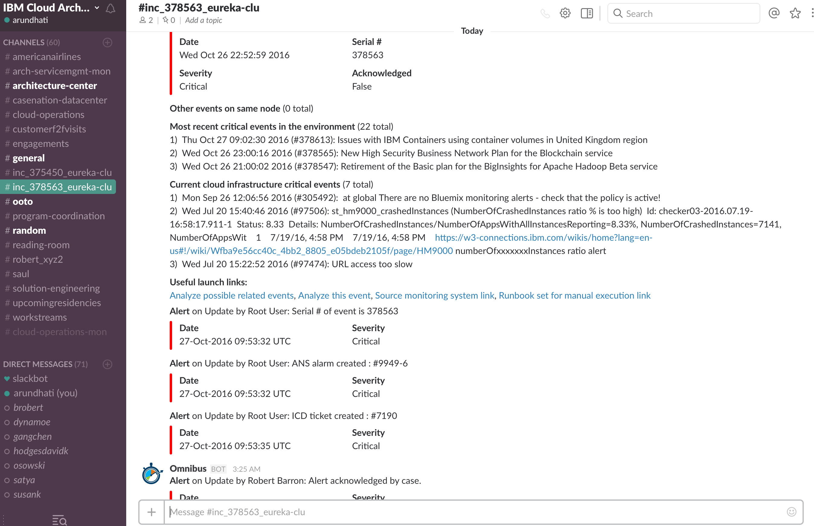

# Slack collaboration for Hybrid application

Slack is an instant messaging and collaboration system on steroids. Slack’s channels help you focus by enabling you to separate messages, discussions and notifications by purpose, department or topic. For incidents which occur in a _BlueCompute_ environment, channels can be used to collobarate on the remediation of the incident with various users like the First Responder, Subject Matter experts, Incident Owner as well as with a numerous number of tools via prebuild integrations.
  

Additionaly events can be send manually from the NOI User Interface. Tools have been added to the eventviewer context menu, which allows to send the event to a standard, a specific or automatic channel. Details for using Slack from NOI can be found in [How to setup NOI for BlueCompute](https://github.com/ibm-cloud-architecture/refarch-cloudnative-csmo/blob/master/doc/EventMgmt/NOI/NOI.md).

##Step 1: Setup Slack

For base setup of a Slack instance, please follow the information of guide [!!!InProgess](InProgess).

##Step 2: View slack message for BlueCompute on channel 

+ Launch your slack team with a browser to view your slack channels:

    https://{yourteam}.slack.com/messages/{channel}

    Replace {yourteam} and {channel} with the name of your slack team and the channel your want to access. 
    
    Example: https://ibmcase.slack.com/messages/BlueCompute

+ Watch for the channel information which have been provided and is constantly flowing in during collaboration.

    

+ Beside user posted messages various activities and commands can be used for the collaboration as required for the remediation case by case, please follow the information of guide [!!!InProgess](InProgess) for a detailed description. 

    This includes acknowledging 

    `noi ack {serialnumber}`

    and resolving 

    `noi resolve {serialnumber}`

    the NOI event by means of a Slackbot, where {serialnumber} is the serial number of the event inside NOI.

